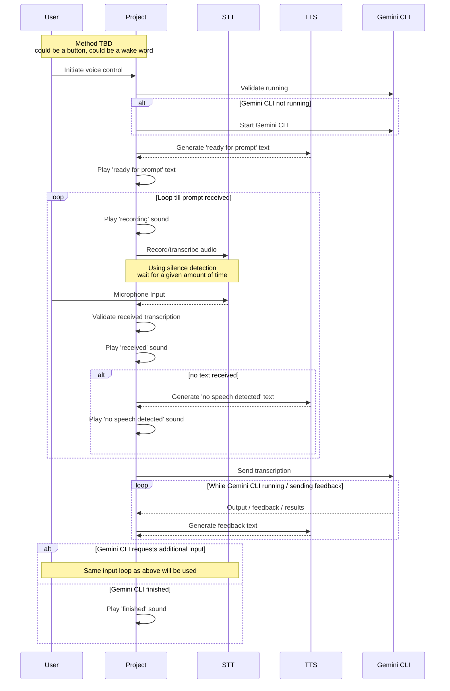

# Voice Control Gemini CLI

## Goal / Origin Story

The goal of this project is to enable a headless communication model with Gemini CLI so Gemini CLI can be used as a voice assistant. The end project I have in mind will require some 'voice vibe coding' hence the decision to use Gemini CLI, even though it may not be the best choice for this task.

The end goal of this project is to get the behaviour fully running on a raspberry pi which doesn't have a keyboard or mouse attached, initial setup however is starting from macOS.

Before starting this I validated approaches using MCP (for example [Voice Mode](https://getvoicemode.com/)) and the built-in accessibility features of macOS. I wasn't able to get the UX I need, nor the flexibility and control I wanted.

Some additional context, including demo videos, are available on the following blog post: [https://michielsioen.be/2025-08-05-voice-vibe-coding-with-gemini-cli/](https://michielsioen.be/2025-08-05-voice-vibe-coding-with-gemini-cli/).

## Flow

## TTS - Kokoro

[Kokoro-TTS](https://huggingface.co/spaces/hexgrad/Kokoro-TTS) is an open-weight TTS model which, with optimizations can very quickly generate the needed text to speech output.

This may be replaced later on with an online service if the end device suffers from performance issues.

## STT - Whisper

[whisper.cpp](https://github.com/ggml-org/whisper.cpp) is a high-performance inference of OpenAI's Whisper model.

For the Speech to Text usecase we'll base ourselves on the 'whisper-command' example tool. To facilitate the functionality I needed I created a [fork](https://github.com/msioen/whisper.cpp/blob/master/examples/command/command.cpp) of the original repository with some modifications.
- the ability to save the activation sound to a file, otherwise every interaction would have to re-record this
- the ability to autoclose after a given amount of time without speech detected

Note - the command we're using is optimized for shorter commands. In our usecase this could mean that in some cases it will not have all the data if it decided to early to commit text as a command.

## Gemini CLI Interaction

### Gemini CLI => Project

[Gemini CLI](https://github.com/google-gemini/gemini-cli) is the open source command-line AI utility from Google. Unfortunately there are no built-in 'hooks' or a way to easily get feedback while it's doing its thing. On top of that in a voice based communication model we also may not want to read out everything it's doing, definitely when starting to display code file changes.

To enable getting feedback from Gemini CLI, the initial plan was to setup our own OpenTelemetry collector and hook in with the built in [OpenTelemetry integration](https://github.com/google-gemini/gemini-cli/blob/main/docs/telemetry.md). This works for the most part but there are some key limitations: approving tools and knowing when the Gemini CLI expects input. Due to these limitations some changes to Gemini CLI were needed regardless which allows us to send the data directly to our project without needing the OpenTelemetry collector in between.

We'll use the existing otel logging code but for the events we want, we'll forward them additionally to our endpoint.

### Project => Gemini CLI

For reverse feedback we have a similar problem. Getting the correct process and sending our input and requests to it isn't that straightforward.

One option could be to self-launch/host the Gemini CLI which could provide all the needed input/output streams but which might be tricky to get everything working. In v1 we'll use AppleScript files to select the terminal window, focus if needed, and input the necessary keystrokes.

## Local Setup

In order to get everything working, this currently builds on two open-source forks:
- [gemini-cli](https://github.com/msioen/gemini-cli)
- [whisper.cpp](https://github.com/msioen/whisper.cpp)

You need both forks available locally and successfully built. The WhisperManager.cs class should be changed with the path to your local whisper.cpp repository.

- run this project
- open the gemini fork => this will automatically start communicating with this project, no additional actions are needed
